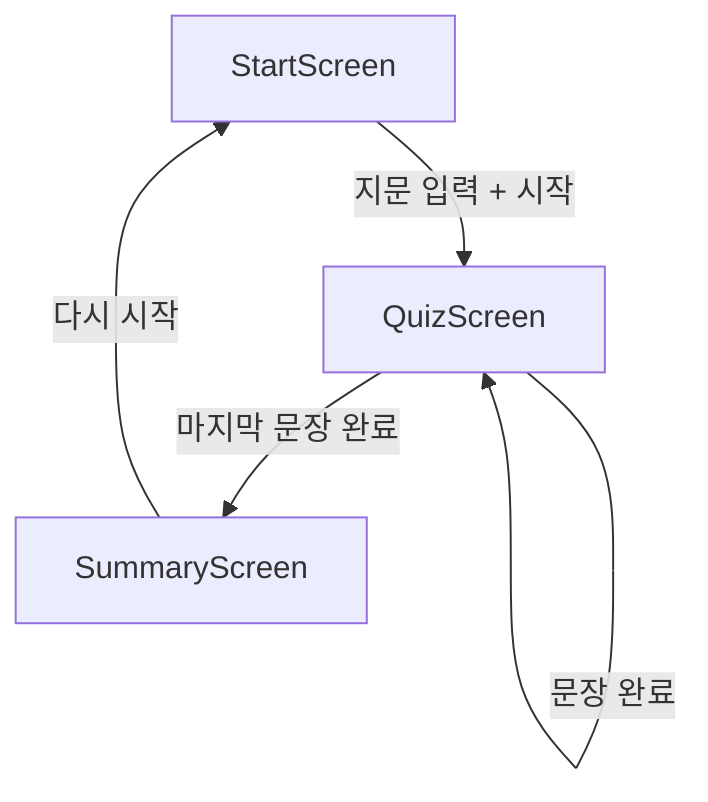
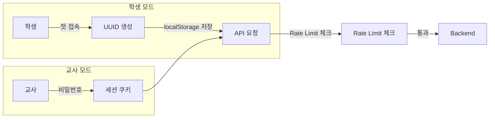

# VerbGravity 구현 계획서 v1.0

| 항목 | 값 |
|------|---|
| **초안 작성일** | 2026-01-15 |
| **작성자** | Claude Opus 4.5 |
| **버전** | v1.0 |
| **1차 검토자** | GPT-5.2-Codex High |
| **1차 검토일** | 2026-01-15 |
| **2차 검토자** | Gemini 3 Pro |
| **2차 검토일** | 2026-01-15 |

iOS Safari 태블릿용 영어 문법 훈련 웹앱. 지문에서 Root 동사와 Subject를 찾는 퀴즈 형태의 학습 도구.

### 용어 정의
- Root: 문장의 중심이 되는 동사(의미동사 기준)
- Subject: 동작의 주체(주어 헤드)

### 프로젝트 핵심 가치
**"능동적 탐색과 즉각적 교정"**
단순히 분석 결과를 보여주는 것이 아니라, 학습자가 직접 문장 성분을 찾고(Trial), 즉각적인 피드백(Feedback)을 통해 개념을 스스로 교정하도록 유도하는 **훈련 도구**를 지향합니다.

---

## 1. 결정된 사항

| 항목 | 결정 |
|------|------|
| 인증 시스템 | 학생: 로그인 없음 (세션 UUID), 교사: 단순 비밀번호 |
| API 보안 | IP Rate Limit (30/분) + 서버 내부용 API Key (브라우저 미노출) |
| 데이터 저장 | 서버에 진행 상황/결과 저장 (SQLite) |
| 사용 규모 | 소규모 (교사 1 + 학생 1) |
| 목표 사용자 | 중1~고3, 수업 중 사용 (추후 자가학습 고려) |
| 지문 출처 | 평가원 공개 모의고사 지문 |
| 교사 화면 | 학생별 요약 + 오답 유형 (Root/Subject), 반 운영 없음 |
| 모드 구분 | 교사 모드 로그인 없으면 모두 학생 모드 |
| 학생 식별 | 세션은 분리 저장, 교사가 세션-학생 매칭을 수정 가능 |
| 프론트엔드 | Vite + React 18, React Context |
| 배포 환경 | Fly.io 단일 앱 (CORS 불필요) |
| spaCy 모델 | `en_core_web_sm` (가벼움, MVP용) |
| PWA/오프라인 | MVP에서 제외 (향후 추가 가능) |

---

## 2. 기술 스택

| 영역 | 기술 | 이유 |
|------|------|------|
| Frontend | **Vite + React 18** | 빠른 HMR, 간결한 설정 |
| Styling | **Vanilla CSS + CSS Variables** | 유지보수 용이, 디자인 시스템 구축 |
| State | **React Context + useReducer** | 복잡도 대비 적절, 외부 의존성 최소화 |
| Backend | **Python FastAPI + spaCy** | 비동기 지원, OpenAPI 자동 문서화 |
| Database | **SQLite** | 소규모 사용, 파일 기반으로 간편 |
| Deploy | **Fly.io (단일 앱)** | FastAPI가 React 빌드 서빙, CORS 불필요 |
| Font | **Inter** (Google Fonts) | 가독성 우수, 다국어 지원 |

---

## 3. 디자인 시스템

### 색상 팔레트 (초록 파스텔톤)

```css
:root {
  /* Primary - 민트/초록 계열 */
  --color-primary-50: #f0fdf4;
  --color-primary-100: #dcfce7;
  --color-primary-200: #bbf7d0;
  --color-primary-300: #86efac;
  --color-primary-400: #4ade80;
  --color-primary-500: #22c55e;
  
  /* Neutral */
  --color-gray-100: #f3f4f6;
  --color-gray-300: #d1d5db;
  --color-gray-500: #6b7280;
  --color-gray-700: #374151;
  --color-gray-900: #111827;
  
  /* Feedback */
  --color-correct: #10b981;
  --color-incorrect: #ef4444;
  --color-hint: #f59e0b;
  --color-inactive: #9ca3af;
}
```

### 토큰 상태 스타일

| 상태 | 스타일 |
|------|--------|
| 기본 (활성 문장) | 흰 배경, 테두리 |
| 호버 | `--color-primary-100` 배경 |
| 선택됨 | `--color-primary-300` 배경, 굵은 테두리 |
| 정답 | `--color-correct` 배경, 체크 아이콘 |
| 오답 | `--color-incorrect` 배경, X 아이콘 |
| 비활성 (다른 문장) | `opacity: 0.4`, `pointer-events: none` |
| Subject Span 힌트 | 밑줄 (`text-decoration: underline`) |

---

## 4. 프로젝트 구조

### Frontend

```
client/
├── index.html
├── src/
│   ├── main.jsx
│   ├── App.jsx
│   ├── index.css                 # 글로벌 스타일, CSS 변수
│   ├── components/
│   │   ├── StartScreen/
│   │   │   ├── StartScreen.jsx
│   │   │   └── StartScreen.css
│   │   ├── QuizScreen/
│   │   │   ├── QuizScreen.jsx
│   │   │   ├── QuizScreen.css
│   │   │   ├── Header.jsx        # 진행도, 현재 단계
│   │   │   ├── PassagePane.jsx   # 문장 렌더링
│   │   │   ├── Token.jsx         # 개별 토큰
│   │   │   ├── Controls.jsx      # 확인/다음/이전 버튼
│   │   │   └── MiniFeedback.jsx  # 정답 여부 + 설명
│   │   └── SummaryScreen/
│   │       ├── SummaryScreen.jsx
│   │       └── SummaryScreen.css
│   ├── context/
│   │   └── QuizContext.jsx       # 전역 상태 관리
│   ├── hooks/
│   │   └── useQuiz.js            # 퀴즈 로직 훅
│   ├── services/
│   │   └── api.js                # 서버 통신
│   └── utils/
│       └── constants.js          # 정책 상수
└── package.json
```

### Backend

```
server/
├── main.py                   # FastAPI 앱, 라우터
├── auth/
│   ├── __init__.py
│   ├── middleware.py         # API Key 검증, Rate Limit
│   └── admin.py              # 교사 비밀번호 인증
├── nlp/
│   ├── __init__.py
│   ├── analyzer.py           # spaCy 분석 로직
│   └── policy.py             # Root/Subject/Span 산출 정책
├── db/
│   ├── __init__.py
│   ├── database.py           # SQLite 연결
│   └── models.py             # 세션/결과 테이블
├── models/
│   └── schemas.py            # Pydantic 스키마
└── requirements.txt
```

---

## 5. 화면 구성

### StartScreen
- 지문 입력 `<textarea>`
- "시작" 버튼 → API 호출 → QuizScreen 전환
- 로딩 상태 표시
- 분석 실패 시 오류 메시지 표시 (`INVALID_INPUT`/`UNSUPPORTED_SENTENCE`)
- 상단 헤더에 '교사 로그인' 링크 표시

### StartScreen 와이어프레임 (MVP)

```
[AppHeader]
VerbGravity (Home)                                  교사 로그인

[Title]  지문 입력
[Textarea]
[Textarea]
  (여기에 지문을 붙여넣기)

[Hint]  최대 2,000자 / 20문장

[Primary Button]  시작
[Status]  로딩 인디케이터
[Error]   입력 오류/분석 실패 메시지
```

### QuizScreen

**구성요소:**
- `Header`: 진행률 바 + 현재 단계 (ROOT/SUBJECT)
- `PassagePane`: 전체 지문 렌더링, 활성 문장만 클릭 가능
- `Controls`: 확인/다음/이전 버튼 + subject 단계에서 `(you 생략)`
- `Controls`: 확인/다음/이전 버튼 + subject 단계에서 `(you 생략)`
- `MiniFeedback`: 정답/오답 판정 및 **오답 원인 힌트** (예: "형용사는 주어가 될 수 없습니다")

**상태 흐름:**
```
IDLE → ROOT_SELECT → ROOT_CHECKED → SUBJECT_SELECT → SUBJECT_CHECKED → NEXT_SENTENCE
```

**정답 표시 타이밍:**
- Root: 확인(Submit) 직후 표시
- Subject: 확인(Submit) 직후 표시

### QuizScreen 와이어프레임 (MVP)

```
[AppHeader]
VerbGravity (Home)                                  교사 로그인

[QuizHeader]  진행률 바  |  단계: 동사(ROOT) / 주어(SUBJECT)

[PassagePane]
문장 1 (활성)
  [토큰][토큰][토큰][토큰] ...
문장 2 (비활성)
  [토큰][토큰][토큰] ...

[MiniFeedback]
정답! 핵심 동사를 찾았습니다. (초록색 체크)

[Controls]
[이전]  [확인]  [다음]  [(you 생략)]
```

### SummaryScreen
- Root/Subject 정확도 표시
- 틀린 문장 목록 (클릭 시 해당 문장으로 점프)
- "다시 시작" 버튼
- 마지막 문장 완료 시 자동 전환

### SummaryScreen 와이어프레임 (MVP)

### SummaryScreen 와이어프레임 (MVP)

```
[AppHeader]
VerbGravity (Home)                                  교사 로그인

[Header]  결과 요약

[Score]
Root 정답률 80%  |  Subject 정답률 70%

[오답 문장 목록]
- 3번 문장 (클릭 시 해당 문장으로 이동)
- 7번 문장

[Primary Button]  다시 시작
```

---

## 6. 전체 화면 플로우 (MVP)



---

## 7. UI 문구 (MVP)
- Root 단계 안내: "문장의 중심 동사를 선택하세요. (진행형/수동태는 의미동사)"
- Subject 단계 안내: "주어(동작의 주체)를 선택하세요."
- `(you 생략)` 버튼: "명령문에서 생략된 주어를 선택합니다."

---

## 8. 입력 제한 (MVP)
- 지문 길이: 공백 포함 최대 2,000자
- 문장 수: 최대 20문장
- 제한 초과 시 400 `INVALID_INPUT`

---

## 9. 재시도 정책 (MVP)
- 문장별 재시도 제한 없음

---

## 10. 재접속 처리 (MVP)
- localStorage에 세션 UUID 저장
- 새로고침 시 동일 세션으로 이어서 진행

---

## 11. 문법 판정 정책 (MVP)

### 문장 필터링 (MVP)
- 구조 기반 필터링은 적용하지 않음 (쉬운 지문 사용)
- 최소 조건: `ROOT` 또는 `nsubj/nsubjpass` 산출 실패 시 422로 분석 실패 응답

### Root 정답 기준
- 주절의 의미동사 1단어
- 조동사(aux) 제외
- be동사(`is/are/was/were`)는 연결동사일 때만 root 인정
- 진행형/수동태는 의미동사 선택 (테스트 결과에 따라 조정)

### Subject 정답 기준
- Head 1단어

### SubjectSpan(밑줄 범위)
- `Det + Adj* + Head + (of-PP)*`
- of-구는 연속적으로 포함 (중간에 다른 수식이 끼면 중단)

### SubjectSpan 공개 타이밍
- `EARLY_HINT`: root 확인 직후 밑줄 표시

### 명령문 처리
- subject는 기본 `(you 생략)` 처리
- 주어 선택 단계에 `(you 생략)` 버튼 제공 (학생이 명시적으로 선택)
- 판정 기준: 주어(`nsubj/nsubjpass`) 없음 + ROOT가 원형 동사

---

## 12. NLP 품질 대응 (MVP)
- 쉬운 지문을 사용하며, 실제 운영/테스트에서 보정 필요 문장 비율을 기록
- 데이터 확인 후 필터링/수정 정책을 결정

---

## 13. 교사 관리 (MVP)
- 세션과 학생 매칭을 수정할 수 있는 관리 기능 제공
- 학생 자동 생성으로 운영 (MVP 1명 기준)
- 확장 시 학생별 로그인 도입 예정
- 기본 표시명: 세션 기준 "학생 1", "학생 2" 순번 부여
- 세션 목록에서 학생 드롭다운으로 재배정 UI 제공
- 교사 화면은 학생 요약 테이블 형태 (학생, 완료 문장, Root/Subject 정답률, 최근 학습)
- 로그인 실패 시 오류 메시지 표시 및 재시도 가능

---

## 14. 교사 화면 요약 지표 (MVP)
- 총 문장 수 / 풀이 완료 문장 수
- Root 정답 수 / Root 정답률
- Subject 정답 수 / Subject 정답률
- 마지막 학습 일시 (`progress.completed_at` 기준)

---

## 15. 교사 화면 오답 분류 (MVP)
- Root 오답
- Subject 오답

---

## 16. 오답 집계 기준 (MVP)
- 문장 기준 (문장별 최종 결과로 집계)
- 최종 시도 기준

---

## 17. 교사 화면 와이어프레임 (MVP)

```
[Header]  VerbGravity  |  로그아웃

[학생 요약 테이블]
학생    완료/전체   Root 정답률   Subject 정답률   최근 학습
학생 1   10/12      80%           70%             2026-01-15 12:34
학생 2   4/12       50%           40%             2026-01-15 11:20

[세션 목록]
세션 ID      생성일시            매칭 학생 (드롭다운)
abc-123      2026-01-15 10:00    [학생 1 ▼]
def-456      2026-01-15 10:30    [학생 2 ▼]
```

---

## 18. API Contract

### POST /api/analyze-passage

**Request:**
```json
{
  "passage": "The quick brown fox jumps over the lazy dog.",
  "config": {
    "level": 1,
    "subjectSpanRevealMode": "EARLY_HINT"
  }
}
```

**Response:**
```json
{
  "sentences": [
    {
      "id": 0,
      "text": "The quick brown fox jumps over the lazy dog.",
      "tokens": [
        { "id": 0, "text": "The", "start": 0, "end": 3, "pos": "DET", "tag": "DT", "dep": "det" },
        { "id": 1, "text": "quick", "start": 4, "end": 9, "pos": "ADJ", "tag": "JJ", "dep": "amod" }
      ],
      "key": {
        "root": 4,
        "subject": 3,
        "subjectSpan": [0, 1, 2, 3]
      }
    }
  ],
  "meta": {
    "totalSentences": 1,
    "model": "en_core_web_sm"
  }
}
```

### 토큰 필드 정의
- `pos`: 품사(UPOS) - 오답 힌트 생성용 (예: `ADJ` -> 형용사)
- `tag`: 세부 품사 - 고급 힌트용
- `dep`: 의존 관계 - 고급 힌트용
- 문장별 `tokens` 배열의 index를 `id`로 사용

### 데이터 저장 API

| Method | Endpoint | 설명 |
|--------|----------|------|
| POST | `/api/sessions` | 새 세션 생성, UUID 반환 |
| PUT | `/api/sessions/{id}/progress` | 문장 완료 시 답변 저장 |
| GET | `/api/sessions/{id}` | 세션 진행 상황 조회 |
| GET | `/api/admin/sessions` | (교사) 전체 세션 목록 |
| PUT | `/api/admin/sessions/{id}/assign-student` | (교사) 세션-학생 매칭 수정 |

### GET /api/admin/sessions 응답 예시

```json
{
  "students": [
    {
      "studentId": "uuid-1234",
      "totalSentences": 12,
      "completedSentences": 10,
      "rootCorrect": 8,
      "rootAccuracy": 0.8,
      "subjectCorrect": 7,
      "subjectAccuracy": 0.7,
      "lastCompletedAt": "2026-01-15T12:34:56Z",
      "wrongTypes": {
        "root": 2,
        "subject": 3
      }
    }
  ]
}
```

### 공통 오류 응답 형식

```json
{
  "error": {
    "code": "INVALID_INPUT",
    "message": "passage is required",
    "details": {
      "field": "passage"
    }
  }
}
```

| HTTP | code | 의미 |
|------|------|------|
| 400 | `INVALID_INPUT` | 요청 필수값 누락/형식 오류 |
| 422 | `UNSUPPORTED_SENTENCE` | 분석 실패 문장 포함 |
| 404 | `SESSION_NOT_FOUND` | 세션 ID 없음 |
| 429 | `RATE_LIMITED` | IP Rate Limit 초과 |
| 500 | `INTERNAL_ERROR` | 서버 내부 오류 |

---

## 19. 인증 및 보안

### 인증 흐름



### API 보안 설정

| 항목 | 값 |
|------|---|
| API Key | 환경변수 `VG_API_KEY` (서버 내부/관리용, 브라우저 미사용) |
| Rate Limit | IP당 30회/분 |
| Admin 비밀번호 | 환경변수 `VG_ADMIN_PW` (bcrypt 해시) |
| 교사 세션 | 로그인 후 24시간 유지 (세션 쿠키 만료) |

---

## 20. 데이터베이스 스키마 (SQLite)

```sql
-- 학생: 교사 관리용 식별자
CREATE TABLE students (
    id TEXT PRIMARY KEY,           -- UUID
    display_name TEXT,
    created_at DATETIME DEFAULT CURRENT_TIMESTAMP
);

-- 세션: 학생별 퀴즈 세션
CREATE TABLE sessions (
    id TEXT PRIMARY KEY,           -- UUID
    created_at DATETIME DEFAULT CURRENT_TIMESTAMP,
    passage_text TEXT NOT NULL,
    total_sentences INTEGER
);

-- 세션-학생 매핑
CREATE TABLE session_student_map (
    session_id TEXT REFERENCES sessions(id),
    student_id TEXT REFERENCES students(id),
    created_at DATETIME DEFAULT CURRENT_TIMESTAMP,
    PRIMARY KEY (session_id, student_id)
);

-- 진행 상황: 문장별 답변 기록
CREATE TABLE progress (
    id INTEGER PRIMARY KEY AUTOINCREMENT,
    session_id TEXT REFERENCES sessions(id),
    sentence_index INTEGER,
    root_answer INTEGER,           -- 선택한 토큰 ID
    root_correct BOOLEAN,
    subject_answer INTEGER,
    subject_correct BOOLEAN,
    completed_at DATETIME          -- UTC ISO8601
);
```

---

## 21. iOS Safari 최적화

```css
/* 터치 최적화 */
.token {
  min-height: 44px;      /* Apple HIG 터치 타겟 */
  padding: 8px 12px;
  user-select: none;
  -webkit-user-select: none;
  -webkit-tap-highlight-color: transparent;
}

/* 활성 문장 자동 스크롤 */
.sentence.active {
  scroll-margin-top: 100px;
}

/* 비활성 문장 */
.sentence.inactive {
  opacity: 0.4;
  pointer-events: none;
}
```

---

## 22. 배포 구성 (Fly.io)

### 단일 앱 구조

```
https://verbgravity.fly.dev/           → React 프론트엔드 (static)
https://verbgravity.fly.dev/api/       → FastAPI 백엔드
```

### 배포 방식
- Docker 멀티스테이지 빌드로 React 빌드까지 컨테이너에서 수행
- FastAPI에서 정적 파일(`client/dist`)을 `/`로 서빙
- 개발 초기에는 로컬에서만 테스트하고, 기능 구현 완료 후 Docker 빌드/배포 진행

### fly.toml

```toml
app = "verbgravity"
primary_region = "nrt"  # Tokyo

[build]
  dockerfile = "Dockerfile"

[env]
  PORT = "8080"

[http_service]
  internal_port = 8080
  force_https = true

[mounts]
  source = "verbgravity_data"
  destination = "/data"
```

### Dockerfile

```dockerfile
FROM node:20-slim AS client-build
WORKDIR /app/client
COPY client/package*.json ./
RUN npm ci
COPY client/ ./
RUN npm run build

FROM python:3.11-slim

# React 빌드 복사
COPY --from=client-build /app/client/dist /app/static

# Python 의존성
COPY server/requirements.txt /app/
RUN pip install -r /app/requirements.txt

# spaCy 모델 다운로드
RUN python -m spacy download en_core_web_sm

COPY server /app/server
WORKDIR /app

CMD ["uvicorn", "server.main:app", "--host", "0.0.0.0", "--port", "8080"]
```

### SQLite 영속성
- DB 파일 경로: `/data/verbgravity.db`
- Fly.io 볼륨에 `/data` 마운트하여 데이터 유실 방지

---

## 23. 테스트 지문

개발 및 테스트에 사용할 예시 지문:

```
One of the most important aspects of sustaining longterm relationships is communication. It's easy to connect with someone and then let the relationship get stuck due to a lack of followup. To keep the connection alive, make a conscious effort to stay in touch. This doesn't mean constantly reaching out with requests or updates but rather maintaining a friendly and consistent line of communication. A simple message to check in or share something of value can go a long way in reinforcing your relationship. For example, if you come across an article or resource that you think might interest a connection, share it with them, even if you haven't spoken in a while. This shows that you're thinking of them and are invested in maintaining the relationship.
```

---

## 24. 로깅/모니터링 (MVP)
- 분석 실패(422) 비율 로그 기록
- 문장별 실패 원인 코드는 `UNSUPPORTED_SENTENCE`로 단일화

---

## 25. Verification Plan

### 자동화 테스트

| 테스트 | 명령어 | 설명 |
|--------|--------|------|
| Frontend Unit | `npm test` | 컴포넌트 렌더링, 상태 변화 |
| Backend Unit | `pytest server/tests/` | NLP 분석 로직, API 응답 |
| E2E | 브라우저 도구 사용 | 전체 플로우 검증 |

### MVP 합격 기준
- 분석 성공률 80% 이상 (422 비율 기준)
- 오답 집계 정확성 80% 이상 (정답 세트 기준 Root/Subject 결과 비교)

### 정답 세트 (MVP)
- 표준 지문 20문장 내외 기준
- 문장별 Root/Subject/SubjectSpan을 수동 라벨링
- 포맷: JSON

#### JSON 필드 예시

```json
{
  "sentences": [
    {
      "id": 0,
      "text": "The quick brown fox jumps over the lazy dog.",
      "tokens": [
        { "id": 0, "text": "The" },
        { "id": 1, "text": "quick" }
      ],
      "key": {
        "root": 4,
        "subject": 3,
        "subjectSpan": [0, 1, 2, 3]
      }
    }
  ]
}
```

### 수동 검증 (iOS Safari)

1. **터치 반응성**: iPad에서 토큰 탭 → 선택 상태 즉시 반영
2. **비활성 문장**: 회색 처리, 탭해도 반응 없음
3. **자동 스크롤**: 다음 문장 이동 시 화면 중앙으로 스크롤
4. **키보드 회피**: 텍스트 입력 시 가상 키보드가 UI를 가리지 않음

---

## 26. 개발 일정 (예상)

| 단계 | 예상 소요 |
|------|----------|
| 프로젝트 초기화 + 디자인 시스템 | 1일 |
| StartScreen + QuizScreen | 2일 |
| SummaryScreen + 상태 관리 | 1일 |
| Backend API + NLP 로직 | 2일 |
| 통합 + iOS 테스트 | 1일 |
| **총계** | **~7일** |

---

## 27. 1차 검토 내역 요약
- 문법 판정 정책, 예외 규칙, 명령문 처리 기준 확정
- 교사 관리/학생 식별/오답 집계 기준 및 화면 구성 정리
- 배포 방식(멀티스테이지), DB 영속성, 보안/에러 응답 규칙 보강
- 테스트 기준/정답 세트/입력 제한/로깅 정책 추가

---

## 28. 2차 검토 내역 요약
- **핵심 가치 정의**: "능동적 탐색과 즉각적 교정" (Trial & Feedback)
- **NLP API 강화**: 오답 원인 분석을 위한 POS(품사) 태그 정보 추가
- **UI/UX 개선**:
  - 전역 헤더(로고/로그인) 추가로 내비게이션 명확화
  - 버튼 및 피드백 메시지 전면 한국어화 (학습자 친화성 증대)
- **디자인 검증**: iPad 목업(v3)을 통해 와이어프레임과 실제 룩앤필 일치 확인

