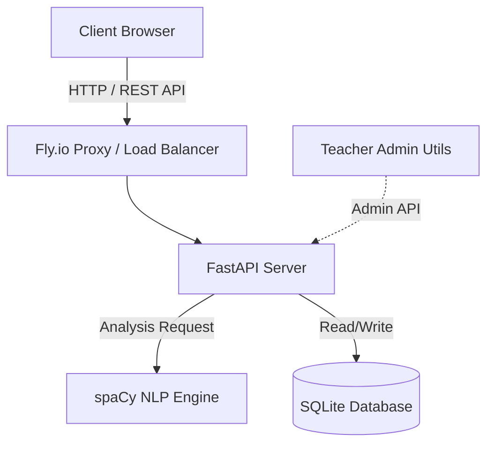
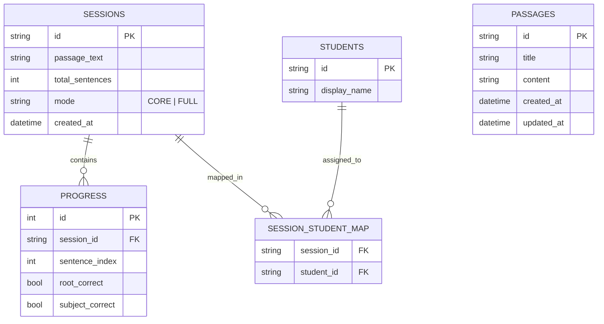

# VerbGravity System Architecture

## 1. 개요 (Overview)
VerbGravity는 영어 문장 구조 학습을 돕기 위한 **반응형 웹 애플리케이션**입니다. 사용자가 입력한 영어 문장을 NLP(자연어 처리) 엔진이 분석하여 문장의 핵심 성분(주어, 동사 등)을 식별하고, 이를 바탕으로 퀴즈를 생성하여 학습자의 구조 파악 능력을 향상시킵니다.

## 2. 기술 스택 (Tech Stack)

### Frontend
- **Framework**: React 18
- **Tooling**: Vite (빠른 번들링 및 개발 서버)
- **Styling**: Pure CSS (Responsive Design), Lucide React (Icons)
- **State Management**: React Context API (`QuizContext`)
- **HTTP Client**: Native `fetch` wrapper (`api.js`)
- **Notifications**: `react-hot-toast` (Toast messages)

### Backend
- **Framework**: FastAPI (Python 3.11+)
- **NLP Engine**: spaCy (`en_core_web_sm` model) - 구문 분석 및 의존성 파싱
- **Database**: SQLite3
- **Server**: Uvicorn (ASGI Server)
- **Security**: bcrypt (비밀번호 해싱), CORS Middleware, Rate Limiting (SlowAPI)

### DevOps / Deployment
- **Infra**: Fly.io
- **Containerization**: Docker (Multi-stage build)
- **CI/CD**: GitHub Actions

---

## 3. 시스템 구조 (System Architecture)



---

## 4. 백엔드 아키텍처 (Backend Architecture)

### 4.1. 디렉토리 구조
```
server/
├── app/
│   ├── main.py        # Entry point & API Routes
│   ├── models.py      # Pydantic Models (DTOs)
│   ├── analyzer.py    # NLP Logic (Core Business Logic)
│   └── database.py    # DB Connection & Schema Config
├── db/                # SQLite Storage
└── requirements.txt   # Dependencies
```

### 4.2. 주요 모듈
*   **NLP Analyzer (`analyzer.py`)**: spaCy를 사용하여 문장의 루트(동사)와 주어를 식별합니다. 복합문(and/but)과 종속절을 처리할 수 있는 재귀적 탐색 로직을 포함합니다.
*   **Database Interface (`database.py`)**: Context Manager 패턴으로 DB 세션을 관리하며, **WAL(Write-Ahead Logging)** 모드를 활성화하여 동시성 문제를 제어합니다.

### 4.3. API 설계 (RESTful)
*   **Public**:
    *   `POST /api/analyze-passage`: 지문 분석 및 퀴즈 데이터 생성
    *   `GET /api/passages`: 저장된 지문 목록 조회
*   **Session**:
    *   `POST /api/sessions`: 학습 세션 생성
    *   `GET /api/sessions/{id}`: 세션 복원
    *   `PUT /api/sessions/{id}/progress`: 학습 진행 상황 저장
*   **Management (Teacher/Admin)**:
    *   **Prefix**: `/api/manage` (AdBlock 차단 회피를 위해 `/admin` 대신 사용)
    *   `POST /api/manage/login`: 관리자 로그인 검증
    *   `GET /api/manage/sessions`: 전체 학생/세션 현황 조회
    *   `DELETE /api/manage/sessions/{id}`: 특정 세션
    *   `DELETE /api/manage/students/{id}`: student delete (student + related sessions)

### 4.5. Deletion Policy
- Session delete: deletes only the session row; related `progress` and `session_student_map` rows are removed via `ON DELETE CASCADE`.
- Student delete: removes the student and all sessions assigned to that student (which cascades to progress and mappings).

### 4.4. NLP Parsing Logic (`server/nlp/analyzer.py`)
spaCy(`en_core_web_sm`)를 활용하여 문장의 핵심 구조를 분석합니다. 기존의 단일 주어-동사 찾기에서 확장되어 **복합문(Compound Sentence)** 처리가 가능합니다.

1.  **Tokenization**: 입력 문단을 문장 단위로 분리하고, 각 문장을 토큰화합니다.
2.  **Root Identification (`find_all_roots`)**:
    *   `sent.root`: 문장의 최상위 루트(주절의 동사)를 먼저 찾습니다.
    *   `conj` Dependency: 등위 접속사(and, but, or)로 연결된 병렬 동사를 추가로 탐색합니다.
    *   `ccomp` Dependency: 보문절(clausal complement) 동사를 탐색하여 복합문의 구조를 파악합니다.
3.  **Subject Mapping (`find_subjects_for_roots`)**:
    *   식별된 각 Root 동사의 자식 토큰들을 순회하며 주어(`nsubj`, `nsubjpass`, `csubj`)를 찾습니다.
    *   **Subtree Expansion**: 주어 토큰뿐만 아니라 주어구 전체(`subj.subtree`) 범위를 계산하여 심화 학습 모드(`subjectSpans`)를 지원합니다.

#### Parsing Examples
| Type (유형) | Sentence | Root | Subject Head (CORE) | Subject Span (FULL) | Note |
|---|---|---|---|---|---|
| **단문 (Simple)** | "The black **cat** sleeps." | `sleeps` | `cat` | `The black cat` | 관사/형용사 포함 |
| **수동태 (Passive)** | "The big **ball** was thrown." | `thrown` | `ball` | `The big ball` | `nsubjpass` + 수식어 |
| **중문 (Compound)** | "I **eat** and **read**." | `eat`, `read` | `I` | `I` | 단일 대명사는 확장 없음 |
| **복문 (Complex)** | "**She** left because **it** rained." | `left`, `rained` | `She`, `it` | `She`, `it` | 종속절 주어 분리 |
| **부정사구 (Phrasal)** | "To **win** the match is hard." | `is` | `win` | `To win the match` | **전체 부정사구 인식** |
| **동명사구 (Gerund)** | "**Swimming** in the sea is fun." | `is` | `Swimming` | `Swimming in the sea` | **동명사구 전체 인식** |
| **분사 수식 (Participle)** | "The car **made** in Korea is good." | `is` | `car` | `The car made in Korea` | **과거분사구(`acl`) 포함** |
| **조동사 (Modals)** | "I **can** speak English." | `speak` | `I` | `I` | 조동사(`aux`)는 제외, 본동사가 Root |
| **유도부사 (Expletive)** | "There **is** a cat." | `is` | `cat` | `a cat` | `expl`(`There`) 제외, `attr`(`cat`) 인식 |
| **가주어 (Dummy It)** | "**It** is hard to study." | `is` | `It` | `It` | 가주어(`It`)를 Grammatical Subject로 인정 |

*Note: **CORE 모드**는 Head만 정답으로 인정하고, **FULL 모드**는 Span 전체를 선택해야 정답으로 인정합니다.*

---

## 5. 데이터베이스 스키마 (Database Schema)

데이터 무결성을 위해 외래 키 제약조건(`ON DELETE CASCADE`)을 적극 활용합니다.

### ER Diagram


*   **Cascade Rule**: `SESSIONS` 테이블의 행이 삭제되면, 관련된 `PROGRESS` 및 `SESSION_STUDENT_MAP` 데이터는 자동으로 삭제됩니다.

---

## 6. 프론트엔드 아키텍처 (Frontend Architecture)

### 6.1. 컴포넌트 구조
*   `App.jsx`: 라우팅 및 전역 레이아웃 관리. `QuizProvider`로 하위 컴포넌트 감쌈.
*   **Screens**:
    *   `StartScreen`: 지문 입력 및 모드 설정
    *   `QuizScreen`: 실제 학습 진행 (문장 표시, 단어 선택 인터랙션)
    *   `SummaryScreen`: 학습 결과 및 통계 표시
*   **Features**:
    *   `TeacherDashboard`: 관리자 기능, 세션 모니터링, 반응형 디자인 적용.
    *   `HintSystem`: 난이도(`CORE`/`FULL`)에 따른 시각적 힌트 제공.

### 6.2. 상태 관리 (State Management)
*   **QuizContext**: 현재 문장 인덱스, 사용자 정답 목록, 점수 등 학습 세션의 전역 상태를 관리합니다.
*   **LocalStorage**:
    *   `verbgravity_session_id`: 페이지 새로고침 시 세션 복원용.
    *   `vg_grading_mode`: 채점 모드(기초/심화) 설정 유지.

### 6.3. 네트워크 (Networking)
*   `services/api.js`: 백엔드 통신을 전담합니다.
*   **Dynamic URL Handling**: 로컬 개발(localhost), 내부망(IP 접속), 배포 환경(Fly.io)을 자동으로 감지하여 올바른 API 엔드포인트로 요청을 보냅니다.

---

## 7. 배포 및 운영 (Deployment)

### Docker Strategy
Python(Backend)과 Node.js(Frontend)를 포함하는 **Multi-stage Build**를 사용합니다.
1.  **Build Stage**: Node.js 이미지에서 React 앱을 빌드합니다 (`npm run build`).
2.  **Runtime Stage**: Python Slim 이미지에 FastAPI 환경을 구성하고, 빌드된 정적 파일(`dist/`)을 복사합니다.
3.  **Run**: FastAPI가 API 요청을 처리하고, 루트 경로(`/`) 등에서 정적 파일을 서빙(`StaticFiles`)합니다.

### Fly.io Configuration
*   `fly.toml`을 통해 관리됩니다.
*   **Volumes**: SQLite DB 파일(`data/verbgravity.db`)의 영속성을 위해 Fly.io Volumes 기능을 사용합니다.
